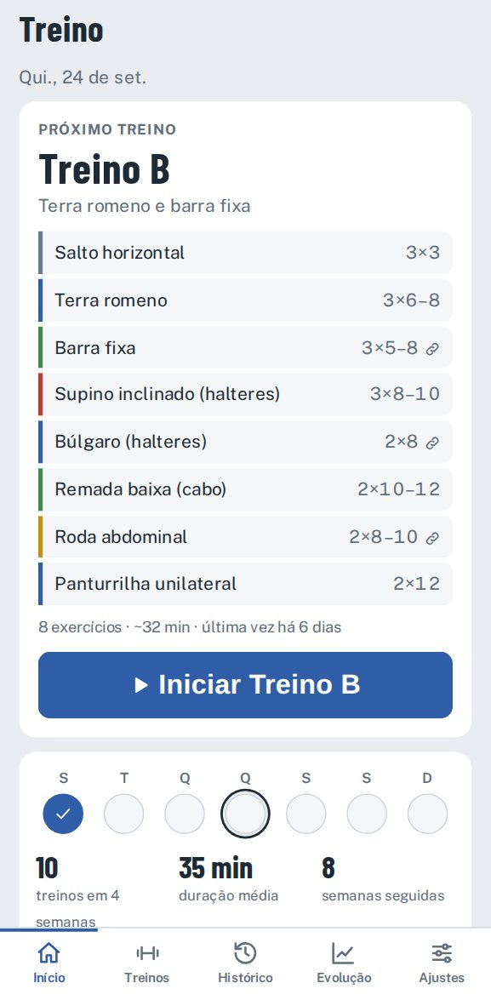
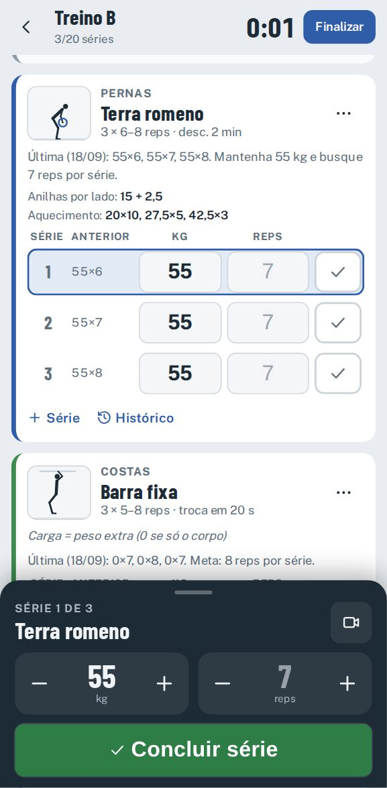
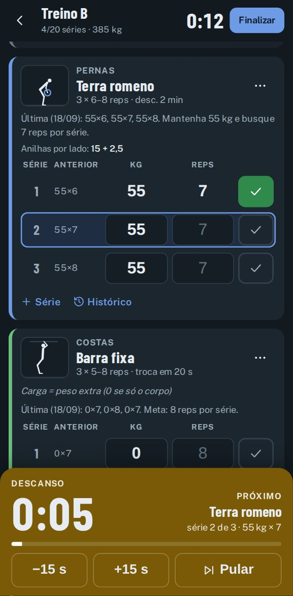
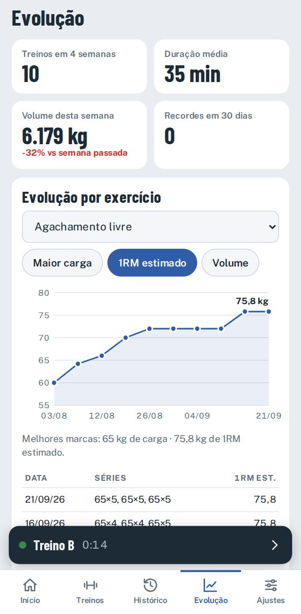

# Treino

App de musculação para usar **durante o treino**, no celular: séries, cargas, descanso com
bipes, vídeos de execução e evolução. É uma versão ampliada do artefato “Diário de treino”,
com os mesmos Treinos A e B já cadastrados.

<p>
  
  
  
  
</p>

## O que tem

**Durante o treino**
- **Painel da série atual** embaixo, no alcance do polegar: carga e repetições com botões −/+
  (sem teclado) e um botão grande **Concluir série**.
- **Tempo total de treino** sempre visível, e duração salva em cada sessão. Se o treino ficar
  esquecido aberto, o app encerra no horário da última série.
- **Descanso automático** ao concluir a série: **um toque quando faltam 5 s** (o painel fica
  âmbar) e **bipe triplo quando acaba**, com vibração no Android. O aviso pode ser de 3, 5 ou 10 s,
  e há opção de anunciar o próximo exercício por voz (“Prepare-se. Supino, 40 quilos”).
  Os bipes são agendados no relógio de áudio, então tocam na hora certa mesmo com a tela bloqueando
  ou o navegador atrasando o JavaScript. A tela fica ligada durante o treino.
- **Memória de carga**: a carga usada numa série passa para as seguintes. A coluna
  **Anterior** mostra o que você fez na mesma série da última vez (toque para copiar).
- **Carga sugerida** conforme a progressão escolhida para cada exercício:
  - *Dupla* (padrão): suba as reps dentro da faixa; bateu o topo em todas as séries, a carga sobe;
  - *Linear*: completou as reps mínimas em todas as séries, a carga sobe;
  - *Manter*: sem aumento (técnica, potência);
  - duas sessões seguidas abaixo do mínimo com a mesma carga → sugere reduzir ~10%.
- **Supersets** (3A/3B do artefato): a ordem alterna série a série, com descanso curto na troca
  e descanso cheio ao fechar a rodada.
- **Recordes** de carga e de 1RM estimado avisados na hora.
- **Barra olímpica**: anilhas por lado e rampa de aquecimento calculadas pela carga.
- **Ajustes do aparelho** (banco na posição 4, pino 3…) salvos no exercício e mostrados em todo treino.
- **Aparelho ocupado?** Troque o exercício, jogue para o fim, adicione ou remova séries.
- **Séries por tempo** (prancha): 5 s de preparação com toque, contagem e conclusão automática.
- Tipos de série: normal, aquecimento (não entra no volume) e drop.
- Ao finalizar: RPE, peso corporal, notas, comparação de volume com a última vez, e a opção de
  **atualizar o treino** com o que mudou no dia.

**Treinos e exercícios**
- Crie, duplique, reordene (a ordem define a rotação A → B → A) e edite treinos: séries, faixa
  de reps, descanso, progressão, incremento e observações.
- Biblioteca com 32 exercícios (os 16 do artefato + comuns de academia), cada um com passos,
  erro comum e alternativas.
- **Vídeos do YouTube**: os 16 exercícios dos Treinos A e B já vêm com 2 vídeos de execução cada.
  Para os outros, “Buscar no YouTube” abre a busca, você cola o link (vídeo ou Short) e define
  **início e fim do trecho**. No treino, o vídeo toca **em loop, sem som, só no trecho da execução**.
  Sem vídeo, aparece a animação do artefato.

**Histórico e evolução**
- Calendário de frequência (16 semanas), lista por mês e detalhe editável de cada sessão.
- Gráfico por exercício (maior carga, 1RM estimado ou volume), treinos por semana, **séries por
  grupo muscular** na semana (com a faixa de 10–20 séries) e peso corporal.
- Cardio avulso (corrida, bike, vôlei…) com ritmo por km.

**Dados**
- Funciona **offline** (é um PWA: dá para instalar na tela inicial).
- Sincronização opcional com **Google Sheets** via Apps Script: backup, uso em mais de um
  aparelho e uma aba com **uma linha por série** para suas análises.
- Backup em JSON/CSV e importação dos dados do artefato antigo.

## Onde os dados ficam

Resumo: **primeiro no aparelho, depois na sua planilha Google**. O comparativo das opções
(só local, Sheets, Firebase/Supabase, arquivo no GitHub) e o funcionamento da sincronização estão em
[docs/armazenamento.md](docs/armazenamento.md).

## Publicar e instalar no celular

1. No GitHub: **Settings → Pages → Build and deployment → Source: GitHub Actions**.
2. Coloque o código na branch `main` (merge deste branch). O workflow
   [`pages.yml`](.github/workflows/pages.yml) roda os testes e publica em
   `https://<seu-usuário>.github.io/treino/`.
   GitHub Pages em repositório **privado** exige plano pago; em repositório público é grátis.
3. No celular, abra o endereço e instale:
   - **Android (Chrome)**: menu ⋮ → *Adicionar à tela inicial / Instalar app*;
   - **iPhone (Safari)**: Compartilhar → *Adicionar à Tela de Início*.

Depois de instalado, o app abre em tela cheia e sem internet.

## Sincronizar com o Google Sheets

1. Crie uma planilha nova no Google Sheets.
2. **Extensões → Apps Script**. Apague o conteúdo e cole [`apps-script/Code.gs`](apps-script/Code.gs). Salve.
3. No seletor de funções, escolha **`setup`** e clique em **Executar**. Autorize o acesso à planilha.
   Em **Registro de execução** aparece `TOKEN: …`: copie esse valor. As abas são criadas nesse passo.
4. **Implantar → Nova implantação → Tipo: App da Web**
   - Executar como: **Eu**
   - Quem pode acessar: **Qualquer pessoa** (o token é que protege os dados)
   - Copie a **URL do app da Web** (termina em `/exec`).
5. No app: **Ajustes → Google Sheets**, cole a URL e o token, toque em **Testar conexão** e depois
   **Sincronizar agora**.

A partir daí o app sincroniza sozinho: ao abrir, ao voltar para o app, ao salvar um treino e
alguns segundos após qualquer edição. O ícone de nuvem no topo mostra o estado (verde: em dia,
amarelo: alterações a enviar, vermelho: erro; toque para ver).

Para usar em outro aparelho, abra o app lá, cole a mesma URL e token e sincronize.

> Ao alterar o `Code.gs`, faça **Implantar → Gerenciar implantações → Editar → Nova versão**
> para manter a mesma URL.

## Trazer os treinos do artefato antigo

**Ajustes → Backup → Importar** aceita o JSON com os registros do “Diário de treino”
(o formato `{kind: 'gym', workout: 'A', sets: {...}}`). Os treinos entram no histórico e as cargas
passam a alimentar as sugestões. Durações impossíveis (rascunho esquecido aberto por dias) são descartadas.

## Dicas de uso na academia

- Deixe o volume de mídia ligado: no **iPhone**, a chave de silencioso também silencia os bipes
  de páginas web, e o Safari não permite vibração. No Android, som e vibração funcionam.
- Com o app instalado, a tela não apaga durante o treino (se o navegador permitir).
- Pode sair da tela do treino (ver histórico, vídeos): o descanso continua contando e a barra
  escura no rodapé leva de volta.
- Tocar numa série (ou no campo dela) a torna a “série da vez” no painel, útil para fazer fora de ordem.
- O número da série alterna entre normal → **Aq** (aquecimento) → **D** (drop).

## Desenvolvimento

Sem build e sem dependências: HTML, CSS e JavaScript (módulos ES) servidos como arquivos estáticos.

```bash
npm test          # testes (Node 20+): lógica, progressão, sessão e o Code.gs contra uma planilha simulada
npm start         # servidor local em http://localhost:8080
```

```
index.html, css/app.css, sw.js, manifest.webmanifest
js/main.js            roteamento (#/...), barra de navegação, tema, service worker
js/state.js           estado em memória + IndexedDB (js/db.js) + eventos
js/sync.js            cliente da planilha (Apps Script)
js/actions.js         ações do treino em andamento
js/timer.js           descanso, bipes, série por tempo, voz, tela ligada
js/media.js, anim.js  vídeo do YouTube (trecho em loop) e animações
js/charts.js          gráficos SVG
js/logic/*.js         regras puras e testadas (progressão, sessão, anilhas, YouTube, backup, merge)
js/views/*.js         telas
js/seed.js            biblioteca de exercícios e Treinos A/B
apps-script/Code.gs   backend na planilha
tests/                testes com node:test
```

Ao adicionar ou remover arquivos do app, atualize a lista `SHELL` em `sw.js` e aumente `VERSION`.
